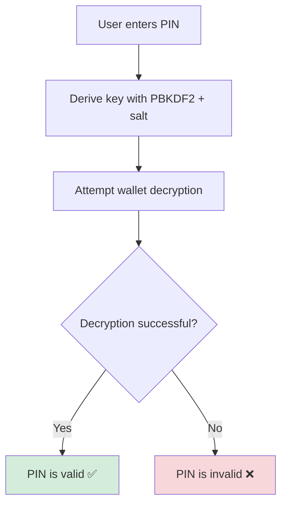

# 🔐 Zero Sight Protocol (ZSP)

> A secure, PIN-based encryption protocol for Web3 custodial wallets and sensitive secrets — built for backend use.

[](https://www.npmjs.com/package/zero-sight-protocol)
[](https://opensource.org/licenses/MIT)
[](https://github.com/yourusername/zero-sight-protocol/actions)

ZSP enables **zero-knowledge, zero-storage authentication** by leveraging AES encryption, PIN-based key derivation (PBKDF2), and stateless session tokens. Your users' PINs are never stored, and wallet decryption serves as PIN verification.

---

## ✨ Key Features

| Feature | Description |
|---------|-------------|
| 🔐 **PIN-based Encryption** | AES-256-GCM encryption using user PIN as key source |
| 🧠 **Secure Key Derivation** | PBKDF2 + salt (HMAC-SHA256) for robust key generation |
| 📦 **Stateless Sessions** | JWT-style session tokens with no server-side storage |
| 📲 **Recovery Ready** | Dual-factor recovery support (Email + SMS OTP) |
| 🔄 **Zero-Trust Model** | No PIN storage or hashing — verification through decryption |
| 🏗️ **Backend Focused** | Designed for secure server-side operations |

---

## 🚀 Quick Start

### Installation

```bash
npm install zero-sight-protocol
```

### Basic Usage

```javascript
import ZSP from 'zero-sight-protocol';

// 1. Encrypt a wallet with PIN
const pin = '1234';
const privateKey = '0xabc123...'; // from ethers.js or similar

const { encrypted, salt } = await ZSP.encryptWallet(pin, privateKey);

// 2. Decrypt wallet with PIN
const decryptedPrivateKey = await ZSP.decryptWallet(pin, encrypted, salt);

// 3. Create session token
const token = ZSP.createSession(userId);

// 4. Verify session token
const userId = ZSP.verifySession(token);
```

---

## 🧠 How It Works

### The Zero-Storage Principle



**ZSP's core innovation**: Instead of storing PIN hashes, we use the PIN to derive an encryption key. If the key successfully decrypts the wallet, the PIN is correct. If not, it's wrong. This eliminates the need to store any PIN-related data.

### Security Model

1. **PIN → Key Derivation**: User PIN + random salt → PBKDF2 → AES key
2. **Encryption**: AES-256-GCM encrypts the private key
3. **Verification**: Successful decryption = valid PIN
4. **Session Management**: Stateless JWT-like tokens for authenticated requests

---

## 📁 Project Structure

```
zsp/
├── src/
│   ├── crypto/
│   │   ├── encrypt.js         # AES-256-GCM encryption
│   │   └── decrypt.js         # AES-256-GCM decryption
│   ├── key/
│   │   └── deriveKey.js       # PBKDF2-HMAC-SHA256
│   ├── session/
│   │   └── sessionManager.js  # Stateless JWT-like sessions
│   └── zsp.js                 # Public API interface
├── test/
│   └── test.js                # Mocha test suite
├── .gitignore
├── package.json
└── README.md
```

---

## 📚 API Reference

### Core Methods

#### `encryptWallet(pin, privateKey)`
Encrypts a private key using the provided PIN.

**Parameters:**
- `pin` (string): User's PIN
- `privateKey` (string): Wallet private key to encrypt

**Returns:**
```javascript
{
  encrypted: "base64...",  // Encrypted private key
  salt: "base64..."        // Random salt for key derivation
}
```

#### `decryptWallet(pin, encrypted, salt)`
Decrypts a private key using the provided PIN.

**Parameters:**
- `pin` (string): User's PIN
- `encrypted` (string): Encrypted private key
- `salt` (string): Salt used for key derivation

**Returns:**
- Decrypted private key (string) or throws error if PIN is incorrect

#### `createSession(userId)`
Creates a stateless session token.

**Parameters:**
- `userId` (string): Unique user identifier

**Returns:**
- Session token (string)

#### `verifySession(token)`
Verifies and extracts user ID from session token.

**Parameters:**
- `token` (string): Session token to verify

**Returns:**
- User ID (string) or `null` if invalid

---

## 🔥 Real-World Example

### Complete Wallet Creation API

```javascript
import express from 'express';
import ZSP from 'zero-sight-protocol';
import { Wallet } from 'ethers';

const app = express();

// Create new wallet endpoint
app.post('/create-wallet', async (req, res) => {
  try {
    const { pin } = req.body;
    
    // Generate new wallet
    const wallet = Wallet.createRandom();
    
    // Encrypt with user's PIN
    const { encrypted, salt } = await ZSP.encryptWallet(pin, wallet.privateKey);
    
    // Store in database (encrypted data only)
    await db.users.update(req.user.id, {
      encryptedWallet: encrypted,
      salt,
      walletAddress: wallet.address
    });
    
    res.status(201).json({ 
      address: wallet.address,
      message: 'Wallet created successfully'
    });
    
  } catch (error) {
    res.status(500).json({ error: 'Wallet creation failed' });
  }
});

// Access wallet endpoint
app.post('/unlock-wallet', async (req, res) => {
  try {
    const { pin } = req.body;
    const user = await db.users.findById(req.user.id);
    
    // Attempt decryption (PIN verification)
    const privateKey = await ZSP.decryptWallet(
      pin, 
      user.encryptedWallet, 
      user.salt
    );
    
    // Create session token
    const sessionToken = ZSP.createSession(req.user.id);
    
    res.json({ 
      sessionToken,
      message: 'Wallet unlocked successfully'
    });
    
  } catch (error) {
    res.status(401).json({ error: 'Invalid PIN' });
  }
});
```

---

## 🛡️ Security Best Practices

### Database Storage
Only store encrypted data in your database:

```javascript
// ✅ Safe to store
{
  "encrypted": "base64...",
  "salt": "base64...",
  "address": "0x...",
  "userId": "user123"
}

// ❌ Never store
{
  "pin": "1234",           // Never store PINs
  "pinHash": "hash...",    // Never store PIN hashes
  "privateKey": "0x..."    // Never store raw private keys
}
```

### PIN Recovery Strategy

Implement secure PIN recovery using dual OTP verification:

```javascript
// Recovery flow example
async function initiatePINRecovery(userId) {
  const emailOTP = generateOTP();
  const smsOTP = generateOTP();
  
  await sendEmail(user.email, emailOTP);
  await sendSMS(user.phone, smsOTP);
  
  // Store OTPs temporarily (with expiration)
  await redis.setex(`recovery:${userId}`, 300, JSON.stringify({
    emailOTP,
    smsOTP,
    timestamp: Date.now()
  }));
}

async function resetPIN(userId, newPIN, emailOTP, smsOTP) {
  // Verify both OTPs
  const storedOTPs = await redis.get(`recovery:${userId}`);
  
  if (verifyOTPs(storedOTPs, emailOTP, smsOTP)) {
    // Re-encrypt wallet with new PIN
    const { encrypted, salt } = await ZSP.encryptWallet(newPIN, oldPrivateKey);
    await db.users.update(userId, { encrypted, salt });
  }
}
```

---

## 🧩 Integration Patterns

### Authentication Flow

ZSP complements traditional authentication systems:

| Step | Purpose | Technology |
|------|---------|------------|
| 1. **App Login** | User authentication | Email/Password, OAuth |
| 2. **PIN Entry** | Wallet access | ZSP PIN verification |
| 3. **Session Management** | Ongoing authentication | ZSP session tokens |
| 4. **Recovery** | PIN reset | Dual OTP verification |

### Middleware Example

```javascript
// ZSP session middleware
const requireWalletSession = (req, res, next) => {
  const token = req.headers.authorization?.replace('Bearer ', '');
  const userId = ZSP.verifySession(token);
  
  if (!userId) {
    return res.status(401).json({ error: 'Invalid or expired session' });
  }
  
  req.userId = userId;
  next();
};

// Protected wallet routes
app.use('/wallet/*', requireWalletSession);
```

---

## 🧪 Testing

Run the test suite:

```bash
npm test
```

The test suite includes:
- Encryption/decryption accuracy
- PIN verification logic
- Session token management
- Error handling scenarios
- Performance benchmarks

---

## 🛠️ Technical Specifications

### Cryptographic Details

| Component | Specification |
|-----------|---------------|
| **Encryption** | AES-256-GCM |
| **Key Derivation** | PBKDF2-HMAC-SHA256 |
| **Salt Generation** | Cryptographically secure random |
| **Session Tokens** | HMAC-SHA256 signed |
| **Iterations** | 100,000 (configurable) |

### Performance Characteristics

- **Encryption**: ~10ms per operation
- **Decryption**: ~10ms per operation
- **Key Derivation**: ~100ms (by design, for security)
- **Session Operations**: <1ms

---

## 🎯 Ideal Use Cases

### Perfect For:
- **Custodial Web3 Wallets** (e.g., MarcediVault)
- **PIN-based Hardware Abstraction Layers**
- **Encrypted Data Lockers**
- **Stateless Backend Authentication**
- **Mobile Wallet Applications**

### Not Suitable For:
- Frontend-only applications
- Direct blockchain interactions
- High-frequency trading systems
- Non-custodial wallet solutions

---

## 🤝 Contributing

We welcome contributions! Please see our [Contributing Guide](CONTRIBUTING.md) for details.

1. Fork the repository
2. Create a feature branch
3. Make your changes
4. Add tests
5. Submit a pull request

---

## 📄 License

MIT License - see the [LICENSE](LICENSE) file for details.

---

## 🔗 Links

- [NPM Package](https://www.npmjs.com/package/zero-sight-protocol)
- [GitHub Repository](https://github.com/jaguarkyng/zero-sight-protocol)
- [Documentation](https://zero-sight-protocol.docs.com)
- [Issue Tracker](https://github.com/dejaguarkyng/zero-sight-protocol/issues)

---

## 💡 Support

Need help? We're here for you:

- 📧 Email: support@xentrius.com
- 💬 Discord: [Join our community](https://discord.gg/zsp)
- 🐛 Bug Reports: [GitHub Issues](https://github.com/dejaguarkyng/zero-sight-protocol/issues)

---

**Built with ❤️ for the Web3 community from Xentrius**

[⭐ Star us on GitHub](https://github.com/dejaguarkyng/zero-sight-protocol) | [🚀 Get Started](#-quick-start) | [📚 Documentation](https://docs.zerosightprotocol.com)

</div>